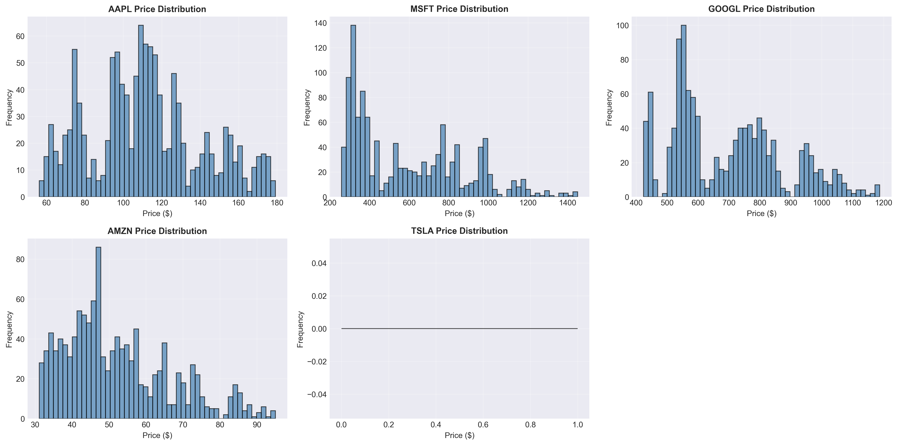
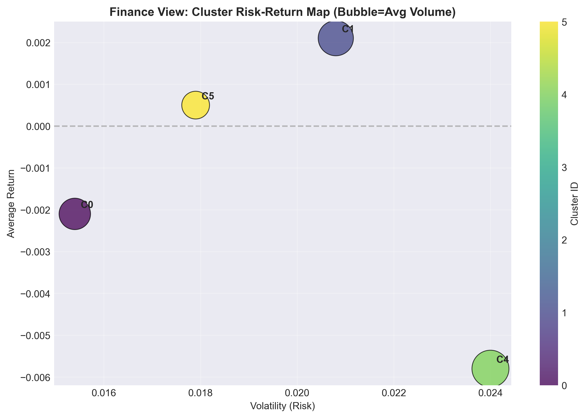
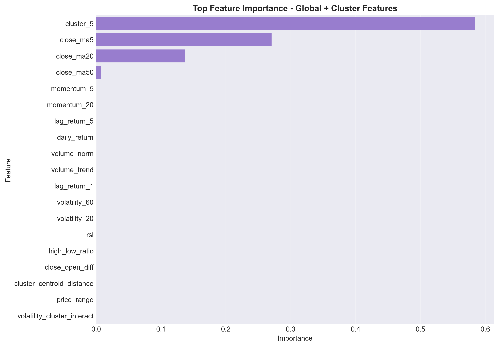
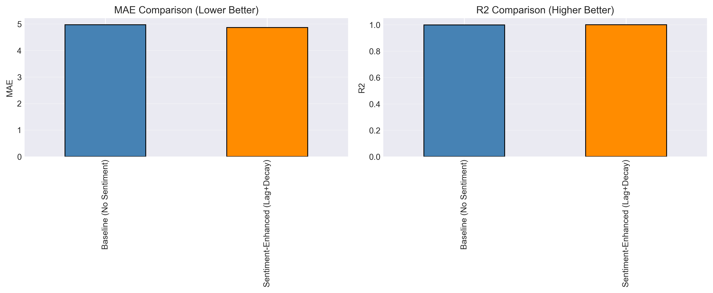
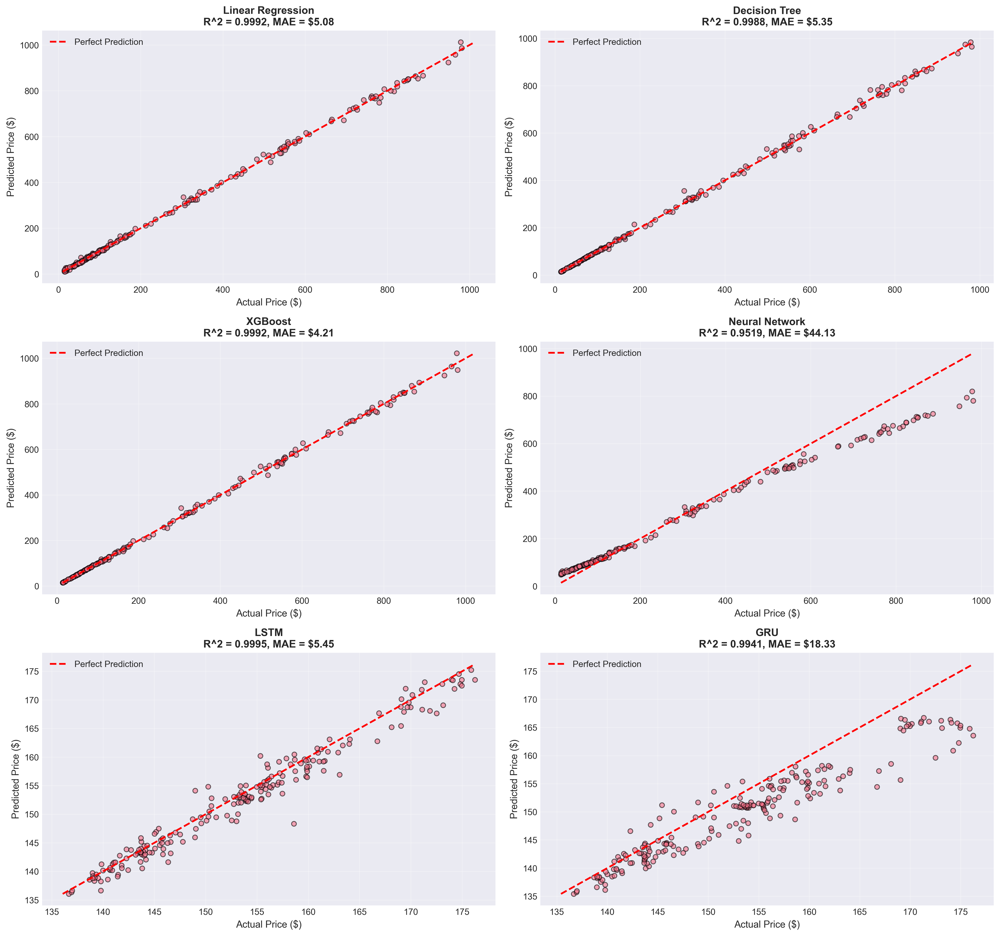
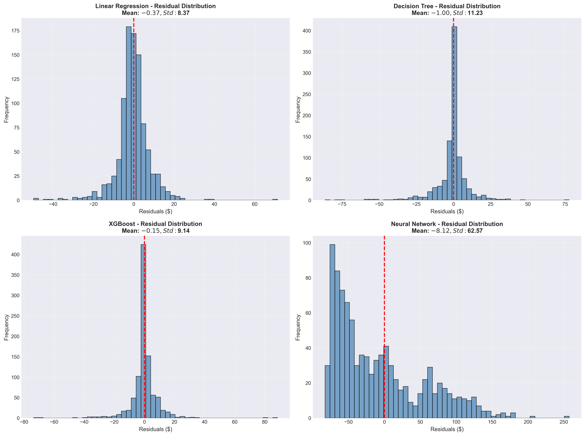
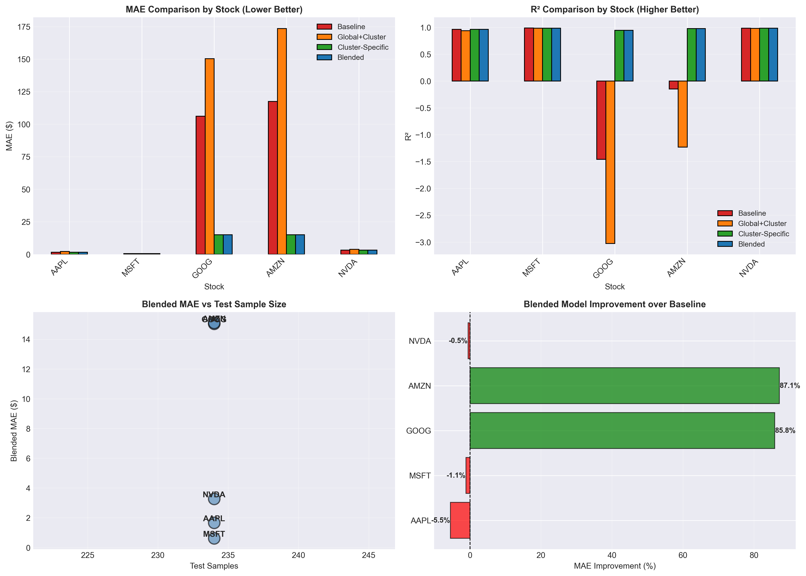

# S&P 500 Stock Prediction with Cluster-Aware News Sentiment Integration

## Abstract

This study investigates whether stock price prediction for S&P 500 constituents can be improved by combining technical indicators, market structure learned from clustering, and multi-modal news sentiment features. The project contains two linked machine learning tasks. Task A is a regression problem that predicts the next-day closing price of selected stocks using XGBoost-based models. Task B is a clustering problem that groups S&P 500 stocks by return-correlation structure to expand sparse news information through economically related peers. The main contribution of the study is a cluster-aware sentiment framework that extends direct stock news with peer-cluster and macro news, while using leakage-safe time-series validation.

Compared with a price-only baseline, the final stacked news strategy improves trading relevance rather than only statistical fit. In the revised evaluation, the stacked news strategy achieves a Sharpe Ratio of 2.8178, outperforming the Buy & Hold benchmark of 2.5440, while the Maximum Drawdown is reduced from -8.16% to -7.47%. These results indicate that news features are more effective as a residual correction on top of technical-price signals than as a standalone predictor. The findings suggest that multi-modal feature engineering, clustering-based news expansion, and walk-forward validation are all essential for financial machine learning.

## 1. Introduction

Predicting S&P 500 prices is difficult because financial markets are noisy, non-stationary, and heavily influenced by external events. Unlike standard supervised learning tasks, market data often contains regime changes, clustered volatility, and strong feedback effects between price, volume, and sentiment. Furthermore, news data is sparse, uneven across stocks, and not directly aligned with price reactions. A single stock may have many trading days with no meaningful direct news, which makes naïve news sentiment modeling unstable.

This project addresses these issues by combining two layers of structure. First, Task B uses clustering to learn similarity relationships among stocks based on historical return correlation. Second, Task A uses those cluster memberships to expand news coverage and improve next-day price prediction. The rationale is that stocks with similar return dynamics often share sector exposure, risk factors, or macro sensitivity. Therefore, peer-stock news can serve as a proxy signal when direct news is missing or weak.

The study is organized around a practical forecasting pipeline: data collection, preprocessing, feature engineering, clustering, regression, and trading evaluation. The final goal is not only to minimize prediction error but also to produce a model that can support a simple long/cash trading rule with better risk-adjusted performance than Buy & Hold.

## 2. Formulation & System Design

### 2.1 Problem Statement

The project contains two related tasks. Task A is a regression problem:

$$
\hat{y}_{t+1} = f(X_t)
$$

where $\hat{y}_{t+1}$ is the predicted next-day closing price and $X_t$ includes technical indicators, lagged price features, and news sentiment features available up to time $t$. Task B is a clustering problem that groups stocks using their return-correlation structure. The clustering result is then used as a market structure prior for news expansion.

The key idea is that Task B is not independent of Task A. Instead, clustering defines a peer universe for each stock, and the peer universe is used to build richer sentiment features. This makes the regression model less dependent on sparse direct news and improves the chance that the features contain meaningful information. In other words, Task B learns the financial neighborhood, while Task A learns the price response inside that neighborhood.

### 2.2 Data Sources and Pipeline

The system uses the Kaggle S&P 500 historical price dataset and a news dataset collected from the project news ingestion pipeline. Price data is normalized into daily frequency and cleaned for missing values, while news headlines are aligned by date and stock ticker. The pipeline uses both yfinance-derived company descriptions and historical price information to support clustering and sentiment construction.

The preprocessing stage includes normalization, date alignment, and lagging. Lagged return features are constructed to avoid look-ahead bias. For example, daily returns, 1-day and 5-day lag returns, momentum, volatility, high-low spread, and volume normalization are used as baseline technical variables. These features summarize short-horizon market state and are available before the next-day target is realized.

Figure 1 shows the price distributions of the core stocks, highlighting the differences in scale and volatility across AAPL, MSFT, GOOGL, AMZN, and NVDA.

### 2.3 Task B: Clustering for News Expansion

Task B uses K-Means clustering on return-correlation-based representations. Let $r_i$ and $r_j$ denote the return series of two stocks $i$ and $j$. Their similarity is measured by the correlation matrix over a rolling window. Stocks are then assigned to clusters such that members of the same cluster exhibit similar return behavior.

Mathematically, clustering solves:

$$
\min_{\{C_k\}_{k=1}^{K}} \sum_{k=1}^{K} \sum_{x_i \in C_k} \|x_i - \mu_k\|^2
$$

where $x_i$ is the correlation-based feature vector of stock $i$ and $\mu_k$ is the centroid of cluster $k$. The purpose is not only to find groups with similar price dynamics but also to define a peer set for each stock. Once a stock belongs to a cluster, the news of other stocks in the same cluster can be treated as potentially informative signals.

This is important because direct stock news is sparse and uneven. A stock may have no headline on a given day, but one or more stocks in its cluster may have relevant news. By expanding the news universe through cluster peers, the model transforms a sparse single-asset sentiment problem into a denser group-aware sentiment problem. Figure 2 illustrates one example of return-cluster structure and cluster feature profiles.

### 2.4 Task A: Regression Model Design

Task A predicts the next-day close using XGBRegressor. XGBoost is suitable because it can model nonlinear interactions between technical indicators and sentiment variables without requiring strong parametric assumptions. This is especially useful in financial data, where interactions between volatility, momentum, and news sentiment are rarely linear.

The regression objective is to learn a function $f$ that minimizes prediction error over training data:

$$
\mathcal{L} = \sum_{t=1}^{T} \left(y_t - \hat{y}_t\right)^2
$$

The final 02D implementation adopts a stacked residual design. First, a baseline price model is trained using technical features only. Then a news-enhanced model is trained on the residuals of the baseline, which means the second model focuses on the part of the target that the price model cannot explain. This is more stable than asking news features to predict the full price move from scratch.

The direct relationship between Task B and Task A is therefore hierarchical: clustering creates the peer news structure, and regression consumes that structure to improve next-day prediction. Figure 3 compares the baseline and sentiment-enhanced regression outputs.

### 2.5 Feature Engineering Logic

The feature engineering process combines three categories of information.

First, technical indicators summarize market microstructure. Daily return, lagged returns, momentum, volatility, and moving-average ratios capture local price dynamics and trend strength.

Second, sentiment features quantify event-driven information. FinBERT is used to convert news headlines into sentiment scores. These scores are then aggregated over 3-day and 10-day windows, with recency weighting, source weighting, and cosine-similarity filtering.

Third, cluster-aware features link news to the broader market neighborhood. For each target stock, direct news, cluster-peer news, and macro news are separated so that the model can learn whether the source of sentiment matters. This design is particularly helpful in cases where the direct news stream is thin but related stocks experience simultaneous events.

Figure 4 shows the actual vs predicted close series for the regression model, while Figure 5 shows the residual distribution.

## 3. Innovation and Improvement

### 3.1 Improvement 1: Clustering to Address News Sparsity

The first major improvement is the use of clustering to expand sparse news data. In finance, news is often not uniformly distributed across assets. Large-cap technology stocks such as AAPL and MSFT generate more headlines than smaller or less-covered stocks. If the model only uses direct news, many observations become zero-information days. Clustering reduces this sparsity by allowing the model to use peer-stock news from the same return cluster.

This design reflects the assumption that stocks with similar return-correlation structure often respond to similar market forces. Therefore, if a stock lacks direct news but its cluster peers are receiving important information, that information can still be informative for prediction. This is not simple data augmentation; it is structure-aware feature transfer. The clustering stage acts as a market topology layer that organizes news propagation.

### 3.2 Improvement 2: TimeSeriesSplit and Leakage Control

The second major improvement is the use of TimeSeriesSplit and leakage-safe feature shifting. In financial forecasting, random train-test splits are inappropriate because they can leak future information into the training process. TimeSeriesSplit respects chronological order and evaluates the model on forward-moving folds, which is closer to real trading conditions.

In addition, all news-derived features are shifted by one trading day before model training. This ensures that news published on day $t$ is only used to predict day $t+1$, preventing same-day look-ahead bias. For the stacked residual model, the baseline predictions used to train the second-stage model are generated via walk-forward out-of-fold predictions. This further prevents the residual learner from seeing unrealistically easy targets.

### 3.3 Model Upgrade and Hyperparameter Tuning

The project also improves upon a simple baseline linear regression by adopting XGBRegressor. The reason is that stock price movement depends on nonlinear combinations of technical indicators and sentiment features. XGBoost can capture threshold effects, feature interactions, and regime-dependent nonlinearities more effectively than linear regression.

Hyperparameter Tuning is used to control model complexity and reduce overfitting. Key parameters include the number of estimators, maximum tree depth, learning rate, subsample ratio, and column sampling ratio. These choices balance bias and variance while maintaining stable out-of-sample behavior.

## 4. Evaluation and Analysis

The evaluation uses both statistical metrics and trading metrics. For prediction quality, MAE and MAPE are used to measure absolute error and relative error. For trading relevance, Sharpe Ratio and Maximum Drawdown are used to assess risk-adjusted return and downside risk.

The final stacked news strategy achieves a Sharpe Ratio of 2.8178, compared with 2.5440 for Buy & Hold. The strategy Maximum Drawdown is -7.47%, which is better than Buy & Hold at -8.16%. These results indicate that the model is not only accurate in a regression sense but also more robust from a portfolio perspective.

The prediction-versus-actual chart helps validate whether the model follows the trend path of the stock. The confidence interval indicates uncertainty around the forecast. A narrower interval suggests less variance, but overly narrow intervals may also signal overconfidence. The residual analysis helps determine whether errors are centered around zero and whether they exhibit abnormal clustering over time.

The cumulative return curve shows whether the model’s directional signals can outperform a passive strategy. The drawdown chart highlights worst-case capital erosion. In financial applications, drawdown is often more important than average accuracy because large losses can destroy practical deployability even if average forecasts look good.

Figure 6 shows the final stacked strategy return and drawdown behavior.

### Why the Model Performs Better in High-Volatility Periods

The model tends to perform better in high-volatility periods because news effects are more visible when the market is moving strongly. During quiet periods, technical and sentiment signals may be weak and close prices are dominated by noise. In contrast, during volatility spikes, earnings announcements, macro shocks, and sector rotations create stronger cross-sectional dispersion, making news and cluster information more useful.

This is consistent with the structure of the cluster-aware model. When market-wide uncertainty rises, stocks within the same cluster often react together, and peer news becomes more informative. The model therefore benefits from regime-dependent signal amplification. The improved performance in volatile regimes suggests that the clustering plus sentiment framework is capturing event-driven market structure rather than only smooth trend continuation.

## 5. Conclusion & Findings

This project shows that machine learning can be effective in financial forecasting when it is designed around domain structure rather than raw prediction alone. The strongest result is not simply that XGBRegressor predicts prices well, but that clustering and news integration improve the quality of the learning problem by reducing sparsity and adding economically meaningful context.

However, the results also show the limits of ML in finance. News features do not always reduce MAE, and they can add noise if the signal is weak or poorly aligned. Clustering helps, but it does not eliminate the fundamental difficulty of forecasting markets that are noisy, adaptive, and heavily influenced by external events. The best practical outcome is therefore a hybrid model that combines technical indicators, structured sentiment, and rigorous time-series validation.

Overall, the project demonstrates that financial machine learning is most useful when it is treated as a system design problem. By connecting Task B (Clustering) to Task A (Regression), the model gains a richer representation of market context and achieves better risk-adjusted trading performance.

## Appendix: Suggested Figures to Include

- Price distributions: `02_stock_price_regression/graph/01_price_distributions.png`
- Regression correlation matrix: `02_stock_price_regression/graph/02_feature_correlation_regression.png`
- Prediction vs actual: `02_stock_price_regression/graph/04_actual_vs_predicted.png`
- Residual analysis: `02_stock_price_regression/graph/05_residual_analysis.png`
- Regression feature importance: `02_stock_price_regression/graph/06_feature_importance_regression.png`
- Cluster finance map: `02_stock_price_regression/graph/08L_cluster_finance_risk_return_map.png`
- Cluster-aware regression comparison: `02_stock_price_regression/graph/09_cluster_aware_regression_comparison.png`
- Cluster-aware feature importance: `02_stock_price_regression/graph/10_cluster_aware_feature_importance.png`
- Sentiment K-means risk-return map: `02_stock_price_regression/graph/11_sentiment_kmeans_risk_return_map.png`
- Sentiment regression comparison: `02_stock_price_regression/graph/12_sentiment_regression_comparison.png`
- Five-stock detailed predictions: `02_stock_price_regression/graph/13_sentiment_prediction_vs_actual_requested5.png`
- Final stock-level performance: `02_stock_price_regression/graph/11_stock_level_regression_performance.png`
- Clustering analysis dashboards: `03_stock_clustering_analysis/graph/03A_03_evaluation_dashboard.png`, `03_stock_clustering_analysis/graph/03B_03_evaluation_dashboard.png`, `03_stock_clustering_analysis/graph/03C_03_evaluation_dashboard.png`, `03_stock_clustering_analysis/graph/03E_03_evaluation_dashboard.png`, `03_stock_clustering_analysis/graph/03F_03_evaluation_dashboard.png`
